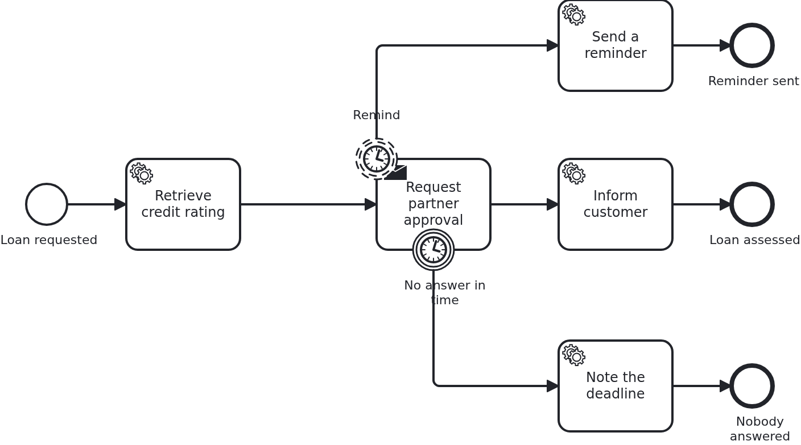

# Boundary events

[](./LICENSE)

Something happens while a task is open: a deadline passes, a reminder is due, a customer
withdraws. A boundary event is how the process reacts, and it comes in two kinds whose
difference decides what your code has to handle. This blueprint puts both on the same task.

## What this blueprint shows



The loan approval of the base blueprint. A partner has to approve the loan, and the task
asking them carries two boundary events:

- **Non-interrupting** (`cancelActivity="false"`), the reminder. Its cycle asks for two
  repetitions while the task is open, it sends a reminder each time and the task **stays
  open**. The token simply splits: the reminder branch runs to its own end event while the
  main branch keeps waiting. How many reminders actually go out before the deadline is the
  engine's business, and it differs - the embedded Camunda 7 got one out in our runs, the
  Camunda 8 cluster two.
- **Interrupting** (the default), the deadline. When it fires, the task is **canceled** and
  the workflow leaves it for good, taking the path behind the event.

For the application the difference is what it must handle:

- The non-interrupting one is an ordinary task on a side branch. Nothing is canceled, so
  nothing is reported as canceled, and the task id the application kept still works
  afterwards - the test proves exactly that by answering the task after a reminder went out.
- The interrupting one ends the wait. The open task is gone, and the handler is called once
  more with `@TaskEvent CANCELED` so it can drop what it kept. **Not every BPMS reports
  that**, so no code may depend on it: answering a task that is gone is a no-op either way.
  Which engines deliver cancellations is on
  [the adapter's wiki page](https://github.com/vanillabp/adapter-platform-integration/wiki/BPMS-adapters),
  and this blueprint asserts the cleared id only where it is delivered.

The two events also compete, which is worth seeing: the reminder cycle is `R2/PT1S` and the
deadline `PT10S`, far enough apart that the order is not a matter of luck. Timers fire when
the BPMS gets to them, and an engine which polls for due jobs may execute two of them in one
sweep - a process whose correctness depends on which of two events comes first is a process
waiting to surprise somebody.

## Delta to the base blueprint

Compared to [`module-single`](https://github.com/vanillabp-blueprints/module-single-springboot):

|            File            |                                       What is different                                        |
|----------------------------|------------------------------------------------------------------------------------------------|
| `loan_approval.bpmn`       | a task waiting for a partner with TWO boundary events on it, one interrupting and one not      |
| `WorkflowTaskHandler.java` | the method of the waiting task plus one per branch behind an event                             |
| `Workflow.java`            | `completeTask` in addition to `startWorkflow`                                                  |
| `Service.java`             | sends the request, sends reminders while it waits, answers the task, notes a missed deadline   |
| `Aggregate.java`           | `partnerApprovalTaskId`, `remindersSent`, `timedOut`, and `@DynamicUpdate` for the side branch |
| `LoanApprovalIT.java`      | a reminder leaving the task open, an answer in time, and the deadline ending the wait          |
| `pom.xml`                  | hands the BPMS of the build to the tests, for the assertion about cancellations                |

## Running it

Requires a JDK 21. Camunda 7 is embedded, so nothing else has to run:

```bash
mvn install verify
```

Running it on another BPMS is a Maven profile, not one line of Java changes:

```bash
mvn install verify -Pcamunda8
```

Camunda 8 is a remote engine, so a cluster has to run. Start one; its address, and everything
else specific to that engine, lives in its profile file
`application/src/main/resources/application-camunda8.yaml`, with a copy for the module's own
test:

```yaml
vanillabp:
  adapters:
    camunda8:
      # Camunda 8 is a remote engine: point this at your cluster.
      rest-address: http://localhost:8080
```

That file is loaded because the Maven profile `camunda8` sets the Spring profile of the same
name, so the engine is chosen once, on the Maven command line, and the build, the tests and
`spring-boot:run` all follow it.

Start the application:

```bash
mvn -pl application spring-boot:run
```

Nothing about identifiers shows up at startup: the BPMS profiles of this blueprint set
`name-clash-avoidance: use-prefix`, so VanillaBP puts the workflow module ID in front of every
identifier before it reaches the engine and takes it off again on the way back. The BPMN files,
the business code and the rest of the configuration keep the plain names, and no tenant is
involved, which matters on a BPMS licensed per tenant. What the modes are and what each of them
costs is in
[the wiki](https://github.com/vanillabp/adapter-platform-integration/wiki/Workflow-modules#how-name-clashes-are-avoided).

Start a loan approval. This is the only URL you need:

```
http://localhost:8080/api/loan-approval/start?amount=5000
```

The partner is asked, and from then on both clocks run:

```
Loan approval '0f7c…' started
Credit rating of loan approval '0f7c…' is 50
Partner was asked to approve loan approval '0f7c…' (5000 at a rating of 50)
Loan approval '0f7c…' waits for the partner, but not forever - the task carries a deadline of ten seconds, and reminders go out while it runs:
  Approved -> http://localhost:8080/api/loan-approval/0f7c…/partner-approved/1a2b…
```

Reminders go out while nothing happens, and the task stays open. How many arrive before the
deadline is up to the engine:

```
Reminder 1 for loan approval '0f7c…' - the partner is still expected to answer
Reminder 2 for loan approval '0f7c…' - the partner is still expected to answer
```

Open the URL any time before the deadline and the answer is still accepted:

```
The partner approved loan approval '0f7c…'
The customer of loan approval '0f7c…' was informed
```

Wait longer, and the interrupting event ends the wait:

```
The partner request of loan approval '4b21…' was canceled
Nobody answered for loan approval '4b21…' in time
```

The first of those two lines is the cancellation reaching the same handler that sent the
request - on a BPMS that reports cancellations. Opening the URL afterwards answers that this
request is not open any more, which the application decides on its own.

While the application runs on Camunda 7, Camunda's own web applications are served at

```
http://localhost:8080/camunda
```

Log in with `demo` / `demo`. Cockpit shows both tokens while the reminder branch runs, which
is the clearest picture of what non-interrupting means. The user comes from
`application/src/main/resources/application-camunda7.yaml` and exists so that the
blueprint can be operated without setting one up; an application with an identity provider
of its own leaves that section out.

The Camunda 8 profile brings neither the dependency nor those settings into effect. Its
tooling is part of the cluster, and the file naming a Camunda 7 adapter id is simply not
loaded there - a profile file applies to its own engine and to no other. Naming an adapter
id whose adapter is not on the classpath is a configuration error VanillaBP refuses to
start with, and the profiles are what keeps that from happening.

## How it works

|                                          File                                          |                                              Role                                              |
|----------------------------------------------------------------------------------------|------------------------------------------------------------------------------------------------|
| `loan-approval/src/main/resources/loan-approval/processes/camunda7/loan_approval.bpmn` | the process: one waiting task carrying a non-interrupting and an interrupting boundary event   |
| `.../loanapproval/WorkflowTaskHandler.java`                                            | the method of the waiting task: `@TaskId` to keep, `@TaskEvent` to hear about the cancellation |
| `.../loanapproval/Service.java`                                                        | asks the partner once, answers the task, and notes a missed deadline                           |
| `.../loanapproval/Workflow.java`                                                       | `completeTask`, the only place `ProcessService` is used                                        |
| `.../loanapproval/model/Aggregate.java`                                                | the task id, the answer and whether the deadline ran out                                       |
| `loan-approval/src/test/.../LoanApprovalIT.java`                                       | answered in time, and not answered at all                                                      |

What the two events have in common: the BPMS decides when they fire and the application only
receives the work. What separates them is the token. A non-interrupting event adds one, so
the reminder runs beside a task that is still open; an interrupting event takes the token
away from the task, which is what makes the task disappear.

That extra token is the part to think about before modelling one, and it is why
`Aggregate` carries `@DynamicUpdate`. Two branches of the same workflow run at the same
time and both save the aggregate: the reminder in a transaction of the BPMS, the answer in
one the application opened. Writing different attributes does not keep them apart by itself,
because JPA saves the whole row - the branch committing second writes back the values it
read at its start, and what the other branch committed in between is gone. No exception, no
log line, and the process behaves exactly as modelled while the data does not.

`@DynamicUpdate` makes Hibernate write only the columns a branch changed, which is enough
here: the reminder counts, the answer writes the answer. Two branches writing the SAME
attribute is a different problem and needs a `@Version` column or a model that does not do
it. This cost a red CI job before it was understood, and the framework describes the second
writer and the ways of dealing with it under [Two writers on one aggregate](https://github.com/vanillabp/adapter-platform-integration/wiki/Workflow-aggregates#two-writers-on-one-aggregate).

The tests wait for the aggregate rather than for a clock. A timer fires when the BPMS gets
to it, so a test that sleeps for exactly three seconds is a test that fails on a slow
machine.

## Documentation

- [Workflow tasks](https://github.com/vanillabp/adapter-platform-integration/wiki/Workflow-tasks#parameters): `@TaskId` and `@TaskEvent`, and what a lifecycle event delivers
- [Completing and canceling asynchronous tasks](https://github.com/vanillabp/adapter-platform-integration/wiki/Workflow-tasks#completing-and-canceling-asynchronous-tasks): the rules the answer follows, and what happens to a task that is gone
- [BPMS adapters](https://github.com/vanillabp/adapter-platform-integration/wiki/BPMS-adapters): which engine reports a cancellation to the application, and which does not
- the wiki of the BPMS adapter you use: how it executes timers, and whether it reports a canceled task to the application

This blueprint is developed in the monorepo
[`blueprints`](https://github.com/vanillabp-blueprints/blueprints). This repository is a
read-only mirror, **issues and pull requests belong there.**

## Noteworthy & Contributors

[VanillaBP](https://www.github.com/vanillabp/spi-for-java) was developed by [Phactum](https://www.phactum.at) with the
intention of giving back to the community as it has benefited the community in the past.


## License

Copyright 2026 Phactum Softwareentwicklung GmbH

Licensed under the Apache License, Version 2.0
